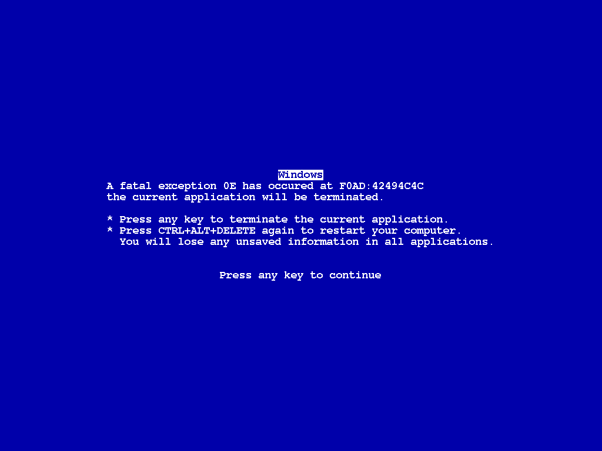
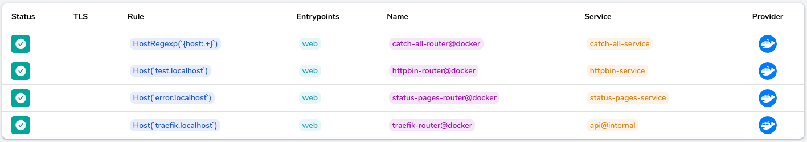
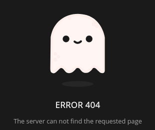
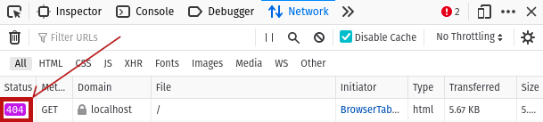
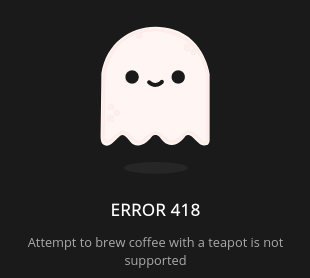

# Traefik Error Pages



## Summary

**This blog post explains in detail how to set up two traefik services and errors middleware in order to show your users a custom `404 Not Found` page on any URL unknown to traefik, as well as custom pages for any status codes that you desire on your other services.**

## Prerequisites

- This post assumes some familiarity with configuring [traefik](https://doc.traefik.io/).
- In order to try the examples, you will need to have installed [Docker Engine](https://docs.docker.com/engine/install/) and [Docker Compose](https://docs.docker.com/compose/install/).

## Intro

At my startup [Unseen Bio](https://unseenbio.com), we recently had a need to display a more friendly page to our customers in the rare occasion that one of our services is down. We use the very enjoyable [traefik reverse proxy and load balancer](https://traefik.io/traefik/) so I took a look at the [documentation for the errors middleware](https://doc.traefik.io/traefik/middlewares/errorpages/). That gave me a good idea of what had to be done but there's nothing better than a working example, right? After a brief search I landed on three pages that got me most of the way: a [post by Andrea Mignone](https://imandrea.me/blog/traefik-custom-404/), [another by Nicholas Dille](https://dille.name/blog/2021/03/14/using-traefik-error-pages-to-handle-unavailable-services/), and a [Docker image with custom error pages with a ready-made traefik configuration](https://github.com/tarampampam/error-pages#custom-error-pages-for-traefik).

Why do I say that they took me _most_ of the way? All three suggest the same basic strategy: Introduce a service that matches any [URL](https://en.wikipedia.org/wiki/URL) with a [low priority](https://doc.traefik.io/traefik/routing/routers/#priority) such that any existing service takes precedence when traefik routes a request. With Docker labels, the configuration might look as follows.

```yaml
labels:
- "traefik.http.routers.catch-all-router.rule=HostRegexp(`{host:.+}`)"
- "traefik.http.routers.catch-all-router.priority=1"
```

## Problem

The problem for us? This _catch-all_ service displays our custom page nicely but since traefik can successfully route the request, the response status is naturally `200 OK`. That means, our availability monitoring wasn't reporting outages and it triggered our engineering [OCD](https://en.wikipedia.org/wiki/Obsessive%E2%80%93compulsive_disorder).

> We needed a catch-all service that always returns `404 Not Found`.

## Solution

Before describing relevant parts of the configuration, I will outline the behavior of the full Docker stack [defined in the repository](https://github.com/Midnighter/errorpages-demo) accompanying this post.

The [docker-compose.yml](https://github.com/Midnighter/errorpages-demo/blob/main/docker-compose.yml) defines four services:

1. A [treafik proxy](https://traefik.io/traefik/) service
2. A catch-all [nginx](https://nginx.org/) service responding with `404 Not Found`
3. Another [nginx](https://nginx.org/) service serving custom pages
4. An [httpbin](https://httpbin.org/) service to conveniently trigger abnormal responses

You can run the examples by [cloning the repository](https://docs.github.com/en/github/creating-cloning-and-archiving-repositories/cloning-a-repository-from-github/cloning-a-repository) and in the repository directory run:

```sh
docker-compose up
```

Traefik is configured to listen on port 80 (the default for [HTTP](https://en.wikipedia.org/wiki/Hypertext_Transfer_Protocol)) so that you can open the dashboard by visiting [traefik.localhost](http://traefik.localhost) in your favorite browser. If you [look at the HTTP routers](http://traefik.localhost/dashboard/#/http/routers), you should see a table just like below.



### Catch-All Service

If instead you visit [localhost](http://localhost/), only the catch-all service's rule will handle that and you will be greeted by a cute custom response.



Furthermore, you will see in the 'Network' tab of your browser's developer tools (which you typically open by pressing F12) that the response status is indeed a 404 and not 200\. How did we achieve that?



In order to understand this bit, we need to dive into the nginx configuration for the catch-all service. The relevant `server` entry looks as below.

```nginx
server {
    listen 80 default_server;

    root /usr/share/nginx/html;

    error_page 404 /404.html;

    location = /404.html {
        internal;
    }

    location / {
        return 404;
    }
}
```

The trick is that we define an nginx error page for status 404 (located at `/usr/share/nginx/html/404.html`) and define it as `internal`. That means it is only visible to nginx itself. We then define a second location that matches any path and always returns status 404 thus always responding with the custom error page and status 404\. With this configuration we get the custom page as well as the status 404 which allows our monitoring to alert us about missing services. Success!

### Error Pages on Services

For completeness, I will also show you how to configure traefik middleware in order to replace responses of a specific service with custom pages. This is useful either if it is cumbersome to customize that service's responses or if you want to configure the same customized responses on multiple services.

To that end, I have created another nginx service and copied custom pages from the [Docker image that I found earlier](https://github.com/tarampampam/error-pages) into it. We then define the errors middleware via Docker labels. We could define the middleware on any service but it makes sense to associate it with the service that is queried for the custom pages.

```yaml
labels:
- "traefik.http.middlewares.status-pages-middleware.errors.status=400,401,403-405,407-413,416,418,429,500,502-505"
- "traefik.http.middlewares.status-pages-middleware.errors.service=status-pages-service"
- "traefik.http.middlewares.status-pages-middleware.errors.query=/{status}.html"
```

Here, I have included all status codes for which custom pages were created. These three lines tell traefik that this middleware responds to the defined range of status codes and will query the `status-pages-service` for a path that depends on the status, for example, `/500.html`.

We then enable the middleware on the httpbin service's router:

```yaml
labels:
- "traefik.http.routers.httpbin-router.middlewares=status-pages-middleware@docker"
```

From then on, any response status from the httpbin service that is among the list of the middleware configured above, will result in the configured query. Here, traefik is in control. So even though querying for the custom page will result in a response `200 OK` (you can test this by visiting [error.localhost/400.html](http://error.localhost/400.html) and watching the 'Network' tab), traefik will replace the response status with the triggering code. You can try this with the httpbin service which lets you trigger any response status, for example, [test.localhost/status/418](http://test.localhost/status/418) (again watching the `Network` tab).



Compare this to [test.localhost/status/406](http://test.localhost/status/406) which is not handled by the middleware.

## Resources

- [Demo repository for this post](https://github.com/Midnighter/errorpages-demo)
- [Traefik error pages documentation](https://doc.traefik.io/traefik/middlewares/errorpages/)
- Posts by:

  - [Andrea Mignone](https://imandrea.me/blog/traefik-custom-404/)
  - [Nicholas Dille](https://dille.name/blog/2021/03/14/using-traefik-error-pages-to-handle-unavailable-services/)

- [Docker image with custom error pages](https://github.com/tarampampam/error-pages)

## Copyright

- The code is copyright © 2021, Moritz E. Beber and shared under the permissive [Apache Software License 2.0](LICENSE).
- The post itself is made available under the [Creative Commons Attribution 4.0 International License](http://creativecommons.org/licenses/by/4.0/) [](http://creativecommons.org/licenses/by/4.0/)
